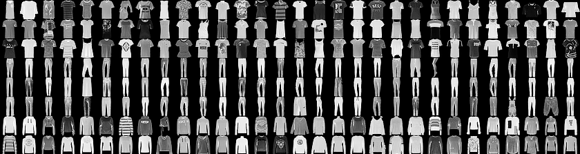

# Artificial Intelligence with TensorFlow
>This repository is composed by different Deep Learning models built with [TensorFlow](https://www.tensorflow.org/) 
 using [tf.keras](https://www.tensorflow.org/api_docs/python/tf/keras) and based on the tutorials that you can find just
[here](https://www.tensorflow.org/tutorials)

## Basic Classification



Corresponding script :
```
basic_classification.py
```
In this script, we train a neural network model (supervised learning) to classify images of clothing, like sneakers, shirts, coats...
We used the Fashion Mnist dataset for both training and testing.
Each image is 28x28 px where each pixel is represented by a value between 0 and 255.
Furthermore, each image has a label corresponding to the type of clothing (sneakers, sandals...)
There are 10 different labels :
* 0 = T-shirt/top
* 1 = Trouser
* 2 = Pullover
* 3 = Dress
* 4 = Coat
* 5 = Sandal
* 6 = Shirt
* 7 = Sneaker
* 8 = Bag
* 9 = Ankle boot

## Text Classification
  

Corresponding script :
```
text_classification.py
```
In this script, we train a neural network model (Binary classification with supervised learning) to classify reviews in two categories : positive and negative.
For that, we used the Internet Movie Database IMDB for both training and testing.
Each review is composed by several integers each representing a specific word in a dictionary. We are provided a map with a word mapped to an integer that we can easily reverse in order to code/decode any review.
All the reviews are acompanied by a label which can be :
* 0 = "Negative"
* 1 = "Positive"

