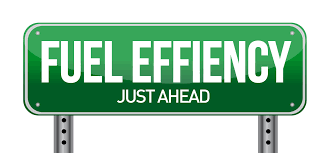

# Artificial Intelligence with TensorFlow
>This repository is composed by different Deep Learning models built with [TensorFlow](https://www.tensorflow.org/) 
 using [tf.keras](https://www.tensorflow.org/api_docs/python/tf/keras) and based on the tutorials that you can find just
[here](https://www.tensorflow.org/tutorials)

## Basic Classification (Clothing Images)


Corresponding script :
```
clothing_images_classification.py
```
Used dataset : [Fashion Mnist](https://github.com/zalandoresearch/fashion-mnist)

In this script, we train a neural network model (supervised learning) to classify images of clothing, like sneakers, shirts, coats...
Each image is 28x28 px where each pixel is represented by a value between 0 and 255.
Furthermore, each image has a label corresponding to the type of clothing (sneakers, sandals...)
There are 10 different labels :
* 0 = T-shirt/top
* 1 = Trouser
* 2 = Pullover
* 3 = Dress
* 4 = Coat
* 5 = Sandal
* 6 = Shirt
* 7 = Sneaker
* 8 = Bag
* 9 = Ankle boot

## Text Classification (Movie reviews)
  
  
Corresponding script :
```
movies_reviews_classification.py
```
Used dataset : [Internet Movie Database IMDB](https://www.tensorflow.org/api_docs/python/tf/keras/datasets/imdb)  

In this script, we train a neural network model (Binary classification with supervised learning) to classify reviews in two categories : positive and negative.
Each review is composed by several integers each representing a specific word in a dictionary. We are provided a map with a word mapped to an integer that we can easily reverse in order to code/decode any review.
All the reviews are acompanied by a label which can be :
* 0 = "Negative"
* 1 = "Positive"

### Overfitting prevention techniques
Corresponding script :
```
movies_reviews_classification_overfitting.py
```
When the accuracy of a model on the validation data peak after training for a number of epochs, and then start decreasing is what we call __overfitting__.
In this scipt we tried to illustrate the different techniques to prevent overfitting when training a model. 
These techniques are :
* Get __more training data__ _(not covered)_
* Add __Weight regularization__ (add to the loss function of the network a cost associated with having large weights. In this case we used the _weight decay (L2 regularization)_ where the cost added is proportional to the square of the value of the weights coefficients)
* Add __Dropouts__ to the layers (consists of randomly "dropping out" (i.e. set to zero) a number of output features of the layer during training. The "dropout rate" is the fraction of the features that are being zeroed-out; it is usually set between 0.2 and 0.5.At test time, no units are dropped out, and instead the layer's output values are scaled down by a factor equal to the dropout rate)
* __Data-augmentation__ _(not covered)_
* __Batch normalization__ _(not covered)_


## Regression (Cars fuel efficiency)
   

Corresponding script :
```
fuel_efficiency_regression.py
```
Used dataset : [Auto MPG](https://archive.ics.uci.edu/ml/datasets/auto+mpg)

This script builds and trains a neural network (Supervised learning) to predict the fuel efficiency (MPG) of late-1970s and early 1980s automobiles (Regression problem).
We used the early stop in the training in order to terminate it when the model was not improving anymore.
